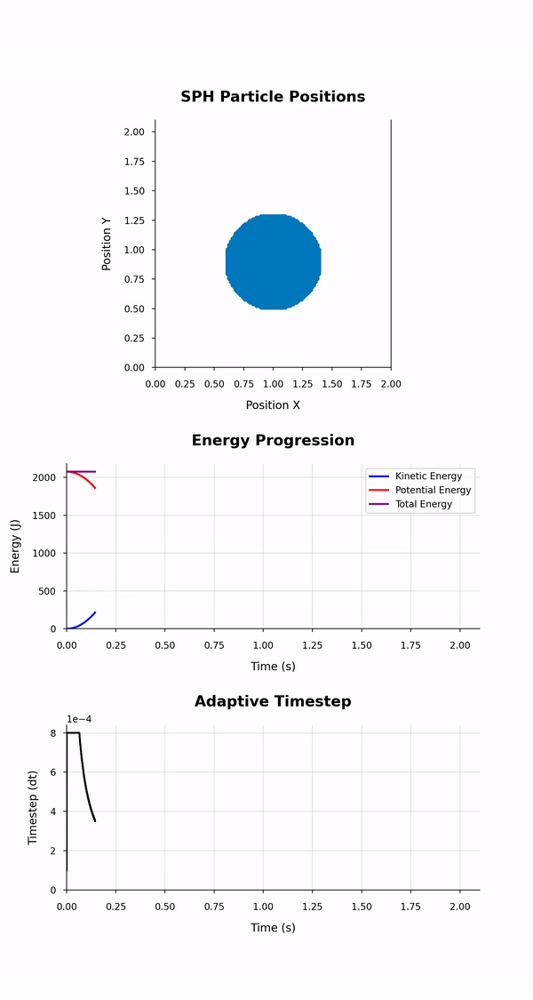

<!-- Your Project title, make it sound catchy! -->

# RECODE-SPH-SOLVER-2D-NS

[](https://cplusplus.com/)
[](https://www.boost.org/)
[](https://www.python.org/)

|  |
|:--:|
| *SPH simulation* |
<!-- Provide a short description to your project -->

## Description

In this project we present a numerical code in C++ which solves the two-dimensional Navier-Stokes equations using the smoothed-particle hydrodynamics (SPH) approach. The focus lies in the implementation (and documentation) of good C++ practices and the development of skills related to efficient, robust, extensible and readable scientific code. The learning process regarding this project can be twofold:

1) The student can study the material provided in the `main` branch of the present repository. It is independent of all the other branches and can be used as a standalone educational resource. In this the implemented SPH methodology is explained as well as the structure of the source code and the post-processing scripts.

2) The student can start by studying progressively the branches `v0` - `v5` in order to experience the process which was followed in order to improve and optimize the herein code. Several comments have been added for each individual version in the corresponding branch to highlight the improvements which were implemented compared to its ancestors.

<!-- What should the students going through your exemplar learn -->

## Learning Outcomes

- I/O (input/output)
- OOP (object-oriented programming)
- C++ containers
- Performance and memory optimization tools and skills

<!-- How long should they spend reading and practising using your Code.
Provide your best estimate -->

| Task       | Time    |
| ---------- | ------- |
| Reading    | 15 hours |
| Practicing | 10 hours |

## Requirements


<!--
If your exemplar requires students to have a background knowledge of something
especially this is the place to mention that.

List any resources you would recommend to get the students started.

If there is an existing exemplar in the ReCoDE repositories link to that.
-->

### Academic

- Experience with basic programming concepts (for loops, functions, reading and writing files etc.).

- Some experience with C++ (familiarity with pointers, C++ classes and the use of external libraries).

- Basic understanding of numerical analysis concepts (time marching, temporal integration etc.)


<!-- List the system requirements and how to obtain them.
-->

### System

For manual installation of the program and its dependencies, you will need the following:

- Python 3.11 installed
- A C++ toolchain along with the necessary development libraries: 
    - build-essential 
    - libboost-program-options-dev, 
    - clang-format
    - cmake. 

You will also need to install the required Python packages by running the command 

- "pip install -r requirements.txt."

If you haven't already, set up the pre-commit hook by executing the 

- "pre-commit install" command.

Following these steps manually will establish the environment necessary for the program to run successfully. Alternatively, to streamline the process, consider using the provided Dockerfile to create a Docker image and deploy the program in a containerized environment, or you can simply use the github codespaces functionality by following the instructions provided in the section [GitHub Codespaces](docs/A2.GH_Codespaces.md).

<!-- Instructions on how the student should start going through the exemplar.

Structure this section as you see fit but try to be clear, concise and accurate
when writing your instructions.

For example:
Start by watching the introduction video,
then study Jupyter notebooks 1-3 in the `intro` folder
and attempt to complete exercise 1a and 1b.

Once done, start going through through the PDF in the `main` folder.
By the end of it you should be able to solve exercises 2 to 4.

A final exercise can be found in the `final` folder.

Solutions to the above can be found in `solutions`.
-->

## Getting Started

To better comprehend this exemplar, it's recommended to follow the outlined procedure by sequentially reviewing the chapters. The suggested workflow ensures a step-by-step understanding, beginning with the foundational SPH algorithm elucidated in the code ([Smoothed-Particle Hydrodynamics (SPH)](docs/1.SPH.md)-[Adaptive timestep](docs/8.Adaptive_Timestep.md)), followed by an exploration of its implementation aspects ([Code overview](docs/2.Code_Overview.md) - [Efficient programming](docs/8.Efficient_Programming.md)). Once you've grasped the code intricacies, it's time to put it into action. In the sections [Code execution](docs/A1.Code_Execution.md) - [Profiling](docs/A4.Post_Analysis.md) you will learn how to run the code, assess its performance and post process the data it generates. Depending on your learning preference, you may opt for a reversed approach, initiating with code execution and subsequently delving under the hood to explore the C++ code. It works both ways!

For additional study and practice, delve into [Clang format](docs/B1.Clang_Format.md), [Building with Cmake](docs/B2.CMake.md) and [Exercises](docs/C1.Exercises.md). These sections offer deeper insights into the project's good practices and provide opportunities to enhance your coding skills.


<!-- An overview of the files and folder in the exemplar.
Not all files and directories need to be listed, just the important
sections of your project, like the learning material, the code, the tests, etc.

A good starting point is using the command `tree` in a terminal(Unix),
copying its output and then removing the unimportant parts.

You can use ellipsis (...) to suggest that there are more files or folders
in a tree node.

-->

## Project Structure

```log
.
├── docs
│   ├── index.md
│   ├── 1.SPH.md
│   ├── 2.Code_Overview.md
│   ├── 3.IO_Overview.md
│   ├── 4.OOP_Concepts.md
│   ├── 5.STL.md
│   ├── 6.Efficient_Programming.md
│   ├── 7.Neighbour_Search.md
│   ├── 8.Adaptive_Timestep.md
│   ├── 9.Code_Execution.md
│   ├── 10.GH_Codespaces.md
│   ├── 11.Profiling.md
│   ├── 12.Post_Analysis.md
│   ├── A1.ClangFormat.md
│   ├── A2.CMake.md
│   └── B1.Exercises.md
├── exec
│   ├── build
│   └── input
│       ├── case.txt
│       ├── constants.txt
│       ├── domain.txt
│       ├── ic-block-drop.txt
│       ├── ic-droplet.txt
│       ├── ic-one-particles.txt
│       ├── ic-two-particles.txt
│       ├── ic-three-particles.txt
│       └── ic-four-particles.txt
├── notebooks
├── post
│   ├── plot_energies.ipynb
│   ├── plot_energies.py
│   ├── simulation_animation.ipynb
│   ├── simulation_animation.py
│   ├── visualise_particles.ipynb
│   └── visualise_particles.py
└── src
    ├── CMakeLists.txt
    ├── fluid.cpp
    ├── fluid.h
    ├── initial_conditions.cpp
    ├── initial_conditions.h
    ├── main_prog_funcs.h
    ├── particles.cpp
    ├── particles.h
    ├── SPH-main.cpp
    ├── sph_solver.cpp
    └── sph_solver.h
```
<!-- readme: collaborators -start -->
<table>
<tr>
    <td align="center">
        <a href="https://github.com/cmcooling">
            
            <br />
            <sub><b>Chris Cooling</b></sub>
        </a>
    </td>
    <td align="center">
        <a href="https://github.com/ChrisPetalotis">
            
            <br />
            <sub><b>Christos Petalotis</b></sub>
        </a>
    </td>
    <td align="center">
        <a href="https://github.com/kmichali">
            
            <br />
            <sub><b>Katerina Michalickova</b></sub>
        </a>
    </td>
    <td align="center">
        <a href="https://github.com/dc2917">
            
            <br />
            <sub><b>Dan Cummins</b></sub>
        </a>
    </td>
    <td align="center">
        <a href="https://github.com/ByronAV">
            
            <br />
            <sub><b>Vyron Avramidis</b></sub>
        </a>
    </td>
    <td align="center">
        <a href="https://github.com/Vasilis421">
            
            <br />
            <sub><b>Vasileios Christou</b></sub>
        </a>
    </td></tr>
<tr>
    <td align="center">
        <a href="https://github.com/geoefsta">
            
            <br />
            <sub><b>George Efstathiou</b></sub>
        </a>
    </td>
    <td align="center">
        <a href="https://github.com/ge420">
            
            <br />
            <sub><b>George Efstathiou</b></sub>
        </a>
    </td></tr>
</table>
<!-- readme: collaborators -end -->

<!-- Change this to your License. Make sure you have added the file on GitHub -->

## License

This project is licensed under the [BSD-3-Clause license](LICENSE.md)
