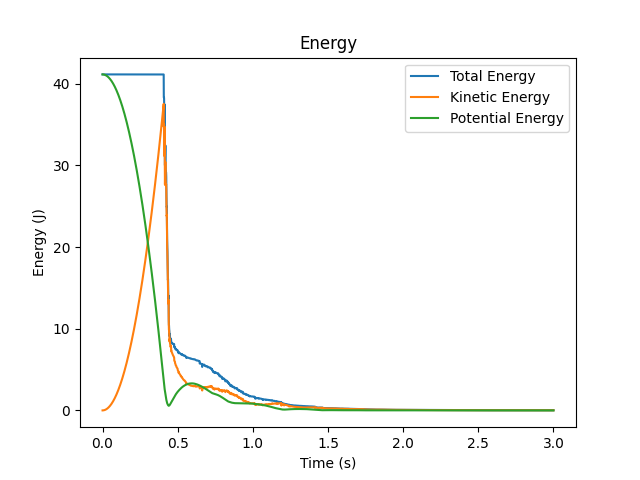
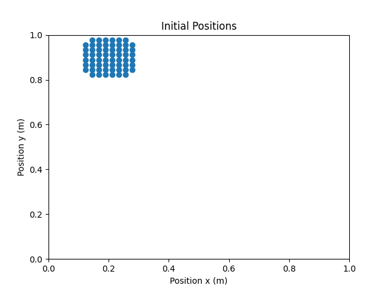

# Overview

The code herein contains a serial C++ implementation of the SPH methodology described in `SPH.md`. The variables associated with the particles' positions, velocities and forces, are stored as members of an object called `fluid`, while the methods of another class called `sph_solver` manifest the steps of the algorithm.

# Files

The `src` directory comprises five `*.cpp` files and their corresponding header (`*.h`) files, as well as the files to build the code.

- `src/SPH-main.cpp`
- `src/sph.{h, cpp}`
- `src/initial_conditions.{h, cpp}`
- `src/main_prog_func.h`
- `src/particles.{h, cpp}`
- `src/fluid.{h, cpp}`
- `src/sph_solver.{h, cpp}`
- `src/CMakeLists.txt`

# Compiling and executing the code

The list of requirements for the source code is:

- A `C++20` version
- The `Boost` library

To compile the code, the user has to change the working directory to `exec/build` and then run the following instructions in the terminal:

```
cmake ../../src
```

and then:

```
cmake --build .
```

This produces an executable file, called `SPH-SOLVER`, in the `exec/build` folder. To execute the code, the user needs to run the following:

```
./SPH-SOLVER
```

To clean the `build` directory, the user can use the following command:

```
cmake --build . --target clean
```

This will effectively delete the binary from the `build` directory.

# Setting up a case

To set up a case the user has to set the parameters of the problem by using the `.txt` files which can be found in the `exec/input` directory. In `case.txt` the user can specify the type of initial condition, the total simulated time (in seconds), the timestep, and the desired output frequency. The initial condition (IC) can be one of the following

- A single particle (`ic-one-particle`) : to test the correctness of time integration and gravity forcing, as well as the bottom boundary condition.

- Two particles (`ic-two-particles`) : to assess the pressure force and viscous terms.

- Three particles (`ic-three-particles`) : to assess left and right boundary conditions.

- Four particles (`ic-four-particles`) : to assess multiple particle interaction.

- A Block drop (`ic-block-drop`): a grid of particles occupying a rectangular region.

- A Droplet (`ic-droplet`): particles occupying a circular region.

After selecting the desired IC, the user has to specify its parameters (number and position of the particles) in the homonymous to the IC `.txt` file. The domain is rectangular and two-dimensional with corners which have coordinates that can be specified in `domain.txt`. Finally, the constant parameters of the problem which characterize the fluid and the solver set-up can be specified in `constants.txt`.

- `case.txt`
  - initial condition (`init_condition`)
  - simulation time (`T`)
  - time-step (`dt`)
  - -output frequency (`output_frequency`)
- `constants.txt`:
  - radius of influence (`h`)
  - gas constant (`gas_constant`)
  - resting density (`density_resting`)
  - viscosity (`viscosity`)
  - acceleration due to gravity (`acceleration_gravity`)
  - coefficient of restituion (`coeff_restitution`)
- `domain.txt`: defines the dimensions of the domain utilised in the simulation
- `ic-one-particle.txt`: sets the initial positions when the selected initial condition is "ic-one-particle"
- `ic-{two, three, four}-particles.txt`: sets the initial positions for the corresponding cases
- `ic-block-drop.txt`: sets initial conditions for SPH, including the number of particles, the length and width of the block, and the initial axes positions for the center of the block
- `ic-droplet.txt`: sets initial conditions for SPH, including the number of particles, the size of the radius of the droplet, and the initial axes positions for the center of the droplet

# Code description

## Reading Inputs

The program expects the aforementioned parameters. When the function `initialize()` is invoked by the main program to read the `.txt` files, the `<boost/program_options.hpp>` library is utilised. This library facilitates the mapping of these parameters to their corresponding values, which are then stored in their respective variables. This approach enhances the flexibility and robustness of the input reading process. Users can specify input parameters in the `.txt` files in any order, provided they are presented as `key = value` pairs.

```cpp
// Process to obtain the inputs provided by the user
po::options_description desc("Allowed options");
desc.add_options()("init_condition", po::value<std::string>(),
                    "take an initial condition")("T", po::value<double>(),
                                                "take integration time")(
    "dt", po::value<double>(), "take time-step")("h", po::value<double>(),
                                                "take radius of influence")(
    "gas_constant", po::value<double>(), "take gas constant")(
    "density_resting", po::value<double>(), "take resting density")(
    "viscosity", po::value<double>(), "take viscosity")(
    "acceleration_gravity", po::value<double>(), "take acc due to gravity")(
    "coeff_restitution", po::value<double>(), "take coeff of restitution")(
    "left_wall", po::value<double>(), "take left wall position")(
    "right_wall", po::value<double>(), "take right wall position")(
    "bottom_wall", po::value<double>(), "take bottom wall position")(
    "top_wall", po::value<double>(), "take top wall position")(
    "length", po::value<double>(), "take length of the block")(
    "width", po::value<double>(), "take width of the block")(
    "radius", po::value<double>(), "take radius of the droplet")(
    "n", po::value<int>(), "take number of particles")(
    "center_x", po::value<double>(), "take center of the particle mass in x")(
    "center_y", po::value<double>(), "take center of the particle mass in y")(
    "init_x_1", po::value<double>(), "take x_1")(
    "init_y_1", po::value<double>(), "take y_2")(
    "init_x_2", po::value<double>(), "take x_2")(
    "init_y_2", po::value<double>(), "take y_2")(
    "init_x_3", po::value<double>(), "take x_3")(
    "init_y_3", po::value<double>(), "take y_3")(
    "init_x_4", po::value<double>(), "take x_4")(
    "init_y_4", po::value<double>(), "take y_4")(
    "output_frequency", po::value<int>(),
    "take frequency that output will be written to file");


    ...


// Map the inputs read from the initial condition file to expected inputs
std::string ic_case = case_vm["init_condition"].as<std::string>();
po::variables_map ic_vm;
std::ifstream icFile;
// Open the file of the initial condition the user has chosen
try {
icFile.open("../input/" + ic_case + ".txt");
// Throw an exception if the file cannot be opened
if (!icFile.is_open()) {
    throw std::runtime_error(
        "Error opening file: " + ic_case +
        ".txt Make sure that the value of the init_condition in the case.txt "
        "file is one of the following: ic-one-particle, ic-two-particles, "
        "ic-three-particles, ic-four-particles, ic-droplet, ic-block-drop.");
}
po::store(po::parse_config_file(icFile, desc), ic_vm);
} catch (std::runtime_error& e) {
// Handle the exception by printing the error message and exiting the
// program
std::cerr << e.what() << std::endl;
exit(1);
}
po::notify(ic_vm);
```

Additionally, error handling is integrated into the input file reading process to guarantee that the provided values conform to the constraints imposed by the underlying mathematical models and the physical meaning of each variable. For example, if the user attempts to set a negative value for the timestep, or a value that is greater than the integration time, the program will throw an error and instruct the user to choose a more suitable value.

```cpp
simulationParameters.dt = case_vm["dt"].as<double>();  // Time step dt
// Error handling for the time step
try {
if (simulationParameters.dt <= 0 or simulationParameters.dt > total_time) {
    throw std::runtime_error(
        "Error: Time step must be positive and lower than the total "
        "integration time!");
}
} catch (std::runtime_error& e) {
// Handle the exception by printing the error message and exiting the
// program
std::cerr << e.what() << std::endl;
exit(1);
}
```

## Class initialisation

The code makes use of three different classes which are purposed to represent the fluid and the algorithm which is being deployed in this project. More details regarding the classes and the design choices can be found in the `docs/OOP_concepts.md` and the reader is advised to study it before proceeding with this chapter.

Firstly, one sph_solver object and one fluid pointer to an object are being declared in the main program. The pointer declaration is used for the `fluid`, because to initialise the object properly the number of particles is required in the user defined constructor and this information is not yet available since the input files have not been read. These objects are passed as a reference to the `initialise()` function. 

Once the input values are read and stored, the provided IC is used to determine the number of particles. This means that although the user has already provided a number of particles, this is just an indication, since the IC (droplet and block drop) require specific formation and the particles to be distributed uniformly. These two conditions cannot be satisfied simultaneously by any number of particles and therefore several adjustments need to be made. The functions `closest_integer_sqrt()` and `rectangle_n()` from `initial_conditions.h` are functions suitable for this purpose. 

The IC functions are being called within the `initialise()` function and a reference to the pointer of the fluid object is passed as an argument, as well as the updated number of particles. Inside these functions the user defined constructor of the `fluid` is being called and the memory allocation process for the object's containers is invoked. In this, the containers are declared as `new` raw pointers to arrays, dynamically allocating memory proportional to the number of particles.

```cpp
void ic_basic(fluid **fluid_ptr, int nb_particles, double *position_x,
              double *position_y) {
  // Allocate memory for the fluid object and call the constructor
  *fluid_ptr = new fluid(nb_particles);

  fluid &fluid = **fluid_ptr;  // Use a reference to the object

  for (int i = 0; i < nb_particles; i++) {
    fluid(0, i) = position_x[i];
    fluid(1, i) = position_y[i];
    fluid(2, i) = 0.0;
    fluid(3, i) = 0.0;
  }

  return;
}
```

To avoid the use of multiple `if` statements, two `std::map` objects are used to map the different conditions to their corresponding number of particles and their corresponding initialisation function.

```cpp
// Fixed nb_particles ic cases
  std::map<std::string, int> initConditionToParticlesMap = {
      {"ic-one-particle", 1},
      {"ic-two-particles", 2},
      {"ic-three-particles", 3},
      {"ic-four-particles", 4}};

  // Get the number of particles based on the ic case
  if (ic_case == "ic-droplet" || ic_case == "ic-block-drop") {
    nb_particles = ic_vm["n"].as<int>();
    // Error handling for the number of particles
    try {
      if (nb_particles <= 0) {
        throw std::runtime_error(
            "Error: Number of particles must be positive!");
      }
    } catch (std::runtime_error& e) {
      // Handle the exception by printing the error message and exiting the
      // program
      std::cerr << e.what() << std::endl;
      exit(1);
    }
  } else {
    nb_particles = initConditionToParticlesMap[case_vm["init_condition"]
                                                   .as<std::string>()];
  }

  // Fixed particles ic cases
  if (ic_case == "ic-one-particle" || ic_case == "ic-two-particles" ||
      ic_case == "ic-three-particles" || ic_case == "ic-four-particles") {
    // Get particles' initial poistions from the ic file
    double* init_x = new double[nb_particles];
    double* init_y = new double[nb_particles];
    for (int i = 0; i < nb_particles; i++) {
      init_x[i] = ic_vm["init_x_" + std::to_string(i + 1)].as<double>();
      init_y[i] = ic_vm["init_y_" + std::to_string(i + 1)].as<double>();
      // Error handling for the initial positions
      try {
        if (init_x[i] < domain_vm["left_wall"].as<double>() ||
            init_x[i] > domain_vm["right_wall"].as<double>() ||
            init_y[i] < domain_vm["bottom_wall"].as<double>() ||
            init_y[i] > domain_vm["top_wall"].as<double>()) {
          throw std::runtime_error(
              "Error: Particles must be within the domain boundaries! Please "
              "adjust the initial position coordinates.");
        }
      } catch (std::runtime_error& e) {
        // Handle the exception by printing the error message and exiting the
        // program
        std::cerr << e.what() << std::endl;
        delete[] init_x;
        delete[] init_y;
        exit(1);
      }
    }
    ic_basic(fluid_ptr, nb_particles, init_x, init_y);
    delete[] init_x;
    delete[] init_y;
    // Block drop case
  } else if (ic_case == "ic-block-drop") {
    // Get the block dimensions and center coordinates from the ic file
    double length = ic_vm["length"].as<double>();
    double width = ic_vm["width"].as<double>();
    // Error handling for the block size (length, width)
    try {
      if (length <= 0 || width <= 0) {
        throw std::runtime_error("Error: Length and width must be positive!");
      }
    } catch (std::runtime_error& e) {
      // Handle the exception by printing the error message and exiting the
      // program
      std::cerr << e.what() << std::endl;
      exit(1);
    }
    double center_x = ic_vm["center_x"].as<double>();
    double center_y = ic_vm["center_y"].as<double>();
    // Error handling for the block initial position (center_x, center_y)
    try {
      if (center_x - length / 2.0 < domain_vm["left_wall"].as<double>() ||
          center_x + length / 2.0 > domain_vm["right_wall"].as<double>() ||
          center_y - width / 2.0 < domain_vm["bottom_wall"].as<double>() ||
          center_y + width / 2.0 > domain_vm["top_wall"].as<double>()) {
        throw std::runtime_error(
            "Error: The block must be within the domain boundaries! Please "
            "adjust the center coordinates.");
      }
    } catch (std::runtime_error& e) {
      // Handle the exception by printing the error message and exiting the
      // program
      std::cerr << e.what() << std::endl;
      exit(1);
    }
    ic_block_drop(fluid_ptr,nb_particles, length, width, center_x, center_y);
    // Droplet case
  } else if (ic_case == "ic-droplet") {
    // Get the droplet radius and center coordinates from the ic file
    double radius = ic_vm["radius"].as<double>();
    // Error handling for the droplet radius
    try {
      if (radius <= 0) {
        throw std::runtime_error("Error: Radius must be positive!");
      }
    } catch (std::runtime_error& e) {
      // Handle the exception by printing the error message and exiting the
      // program
      std::cerr << e.what() << std::endl;
      exit(1);
    }
    double center_x = ic_vm["center_x"].as<double>();
    double center_y = ic_vm["center_y"].as<double>();
    // Error handling for the droplet initial position (center_x, center_y)
    try {
      if (center_x - radius < domain_vm["left_wall"].as<double>() ||
          center_x + radius > domain_vm["right_wall"].as<double>() ||
          center_y - radius < domain_vm["bottom_wall"].as<double>() ||
          center_y + radius > domain_vm["top_wall"].as<double>()) {
        throw std::runtime_error(
            "Error: The droplet must be within the domain boundaries! Please "
            "adjust the center coordinates.");
      }
    } catch (std::runtime_error& e) {
      // Handle the exception by printing the error message and exiting the
      // program
      std::cerr << e.what() << std::endl;
      exit(1);
    }
    ic_droplet(fluid_ptr, nb_particles, radius, center_x, center_y);
  } else {
    std::cerr << "Error: Initial condition function not found! Make sure "
              << "that the value of the init_condition in the case.txt file is "
              << "one of the following: ic-one-particle, ic-two-particles, "
              << "ic-three-particles, ic-four-particles, ic-droplet, "
              << "ic-block-drop." << std::endl;
    exit(1);
  }


```

Finally, after the object initialisation, the rest of the parameters which are required by the `sph_solver` and the `fluid` objects are being set with the use of setter functions.

```cpp
  sph_solver.set_timestep(case_vm["dt"].as<double>());
  sph_solver.set_total_iter(ceil(
      total_time /
      case_vm["dt"].as<double>()));
  sph_solver.set_output_frequency(case_vm["output_frequency"].as<int>());
  sph_solver.set_coeff_restitution(
      constants_vm["coeff_restitution"].as<double>());
  sph_solver.set_left_wall(domain_vm["left_wall"].as<double>());
  sph_solver.set_right_wall(domain_vm["right_wall"].as<double>());
  sph_solver.set_top_wall(domain_vm["top_wall"].as<double>());
  sph_solver.set_bottom_wall(domain_vm["bottom_wall"].as<double>());

  fluid* objPtr = *fluid_ptr;

  objPtr->set_rad_infl(constants_vm["h"].as<double>());
  objPtr->set_gas_constant(constants_vm["gas_constant"].as<double>());
  objPtr->set_density_resting(constants_vm["density_resting"].as<double>());
  objPtr->set_viscosity(constants_vm["viscosity"].as<double>());
  objPtr->set_acceleration_gravity(
      constants_vm["acceleration_gravity"].as<double>());

  // Calculate the mass of the particles
  objPtr->calc_mass();
```

## Output files

The output files are being initialised with the use of the `init_output_files()`. The outputs are exported in `.csv` format which displays good readability and facilitates data manipulation compared to `.txt` files. They are stored in a centralised location, specifically within the `/exec/output/` directory. This centralisation simplifies data organisation and retrieval, making it easier for users to access and analyse output data.

Upon successful execution, the program generates two types of files:

- _Energies File_: This file, containing Total, Kinetic, and Potential energies, is updated at each timestep. The results can be visualized by using the script `post/plot_energies.py`.

- _Particle Positions File_: This file captures the positions of the particles at a given timestep, and it can be visualized using the script `post/visualize_particles.py`.

```cpp
void storeToFile(fluid& fluid, int nb_particles, std::string type,
                 std::ofstream& targetFile, double dt, int currentIteration) {
  if (type == "energy") {
    // Write energies on the Energy-File
    targetFile << currentIteration * dt << "," << fluid.get_kinetic_energy()
               << "," << fluid.get_potential_energy() << ","
               << fluid.get_potential_energy() + fluid.get_kinetic_energy()
               << "\n";
  } else if (type == "position") {
    for (int k = 0; k < nb_particles; k++) {
      targetFile << fluid.get_position_x(k) << "," << fluid.get_position_y(k)
                 << "\n";
    }
  }
}
```

<div style="text-align: center;">
    
    <figcaption>Energy plots for a droplet of 60 particles.</figcaption>
    
    <figcaption>Initial positions for a droplet of 60 particles.</figcaption>
</div>


## Time integration

Following the initialisation of the class and the output files, the function `sph_solver::time_integration()` is invoked. Within this function, the aforementioned steps of the SPH algorithm are being implemented, and the outputs are exported.

```cpp

/* ***************************** SPH-main.cpp ****************************** */

 // Time integration loop
  sph_solver.time_integration(*sph_fluid, finalPositionsFile, energiesFile);

  /* **************************** sph_solver.cpp **************************** */

  void sph_solver::time_integration(fluid &data,
                                  std::ofstream &finalPositionsFile,
                                  std::ofstream &energiesFile) {
  std ::cout << "Time integration started -- OK"
             << "\n";

  number_of_particles = data.get_number_of_particles();

  for (int time = 0; time < total_iterations; time++) {
    t = time;
    // In each iteration the distances between the particles are recalculated,
    // as well as their density and pressure
    data.calc_particle_distance();
    data.calc_density();
    data.calc_pressure();
    particle_iterations(data);

    if (time % output_frequency == 0) {
      storeToFile(data, "energy", energiesFile, dt, t);
    }
  }
  // Store particles' positions after integration is completed
  storeToFile(data, "position", finalPositionsFile, dt, total_iterations);

  std ::cout << "Time integration finished -- OK"
             << "\n";
}

```

