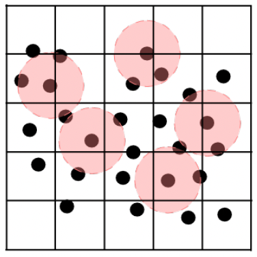

# Neighbour Searching Algorithm

In SPH, each particle is only influenced by the particles that are within a maximum distance (the radius of influence $h$) of it. These particles are usually called the particle's neighbours, and there are numerous approaches and algorithms that can be used to identify them. There are approaches that are as simple as just checking the distance between every pair of particles in each iteration. However, as the number of particles increases, the inefficiency of such algorithms constitutes them unacceptable, and a more sophisticated solution is needed.

## Big O Notation

Big O notation is a mathematical notation used to describe the asymptotic behaviour of a function or algorithm. It is commonly used in computer science to analyze the performance of algorithms in terms of their time complexity. Big O notation provides a way to classify algorithms based on their efficiency and scalability. It helps us understand how the time or space requirements of an algorithm grow as the size of the input increases. In Big O notation, we express the upper bound or worst-case scenario of an algorithm's time complexity in terms of a mathematical function. For example, an algorithm with a time complexity of $\mathcal{O}(n)$ means that its execution time grows linearly with the size of the input. An algorithm with $\mathcal{O}(n^2)$ time complexity means that its execution time grows quadratically with the size of the input, and so on.

## Brute Force Approach

A brute force algorithm is a straightforward approach to solving a problem that exhaustively tries all possible solutions. For certain problems, this can lead to exponential time complexity, making brute force algorithms impractical for large inputs.

In our initial implementation, we followed a brute force approach, where, for each particle, we would iterate over all particles, calculate their separation, compare it to the radius of influence, and finally, if the particle was a neighbour, we would proceed to the SPH calculations. This approach resulted in a complexity of $O(n^2)$, indicating an inefficient algorithm that should be replaced.

## Cells Neighbour Searching

A cells neighbour searching algorithm is an optimisation technique used to efficiently find neighbouring elements within a spatial grid or partitioned space. Instead of comparing each element with every other element, this approach divides the space into smaller cells or buckets and only considers elements within the same or neighbouring cells. For example, in the context of particle simulation or computational fluid dynamics, a cells neighbour searching algorithm can significantly reduce the number of pairwise comparisons needed to calculate interactions between particles. By organizing particles into spatial cells and only considering interactions between particles within the same or adjacent cells, the algorithm achieves a time complexity close to $\mathcal{O}(n)$, making it much more scalable and efficient than brute force approaches for large datasets. In more detail:

- Creating the grid and placing particles in cells: This step involves iterating over all particles and determining their cell index based on their position. This step has a time complexity of $\mathcal{O}(n)$.

- Searching for neighbours: Once the particles are placed in cells, searching for neighbours involves iterating over each particle and checking neighbouring cells to find particles within the radius of influence. The complexity of this step depends on the number of neighbouring cells each particle needs to check. If each particle checks a constant number of neighbouring cells, the complexity remains $\mathcal{O}(n)$.

- Iterating over particle neighbours: Finally, iterating over each particle's neighbours to perform SPH calculations typically has a complexity of $\mathcal{O}(kn)$, where $k$ is the average number of neighbours per particle and $k < n$.

|  | 
|:--:| 
| *Schematic representation of the domain which is split in cells (black lines) and the area of influence (red circles) around the particles (black dots). The snapshot was taken from https://doi.org/10.2312/cgvc.20191258.* |


The overall time complexity of the cells neighbour searching algorithm depends on the number of neighbours each particle checks. If the grid structure is properly optimised, the algorithm can achieve close to $\mathcal{O}(n)$ complexity.

In the current implementation, we follow a neighbour searching algorithm that is based on partitioning the domain into square grid cells. These side length of these cells is equal to the radius of influence. The benefit of this design decision is that we know in advance that a particle's neighbours may only lie in the same cell as the particle, or in one of the neighbouring cells. We therefore do not need to iterate over all particles and check their separations before every calculation.

```cpp
/* **************************** sph_solver.cpp **************************** */

void SphSolver::createGrid(Fluid &data) {
  numberOfParticles = data.getNumberOfParticles();
  neighbourParticles.resize(numberOfParticles);

  double radiusOfInfluence = data.getRadInfl();
  int cellsRows =
      static_cast<int>(std::ceil((topWall - bottomWall) / radiusOfInfluence));
  int cellsCols =
      static_cast<int>(std::ceil((rightWall - leftWall) / radiusOfInfluence));
  numberOfCells = cellsRows * cellsCols;
  cells.reserve(numberOfCells);
  neighbourCells.reserve(numberOfCells);

  assignNeighbourCells(cellsRows, cellsCols);
}
```

The first step of the algorithm is to turn the domain to a grid, by splitting it into cells. This logic is implemented in the `SphSolver::createGrid()` function. It should be noted that all neighbour searching functions have been implemented as member functions of the `SphSolver` class, since the algorithm is a part of the SPH system. In this function, we calculate the number of cell rows and columns that form the grid, by dividing the corresponding domain dimension (length and width accordingly) by the cell side length (radius of influence). Since the result of this division is not guaranteed to be an integer, we use `ceil` to get the next integer number, and `static_cast<int>` to change the `double` to an `int`, which is the final number of cell rows/columns. The reason we use `ceil` to round up to the next integer, instead of just rounding down by simply casting the `double` to an `int`, is to be sure that the whole domain is considered. This way, even though parts of some cells may lie outside the domain, it is guaranteed that the algorithm will not miss any particles. 

Finally, we resize the two containers that will be used to store each cell's particles (`cells`) and neighbouring cells (`neighbourCells`). Each of these containers is a vector of vectors. The outer vector is used to store cells. In the case of the `cells` container, each inner vector will hold the indices of the particles that lie within the cell, and in the case of the `neighbourCells`, the inner vector will hold the indices of the current cell's neighbouring cells. This way, the algorithm will be able to search for neighbour particles both in a cell, as well as in its neighbouring cells.

```cpp
/* **************************** sph_solver.cpp **************************** */

void SphSolver::assignNeighbourCells(int cellsRows, int cellsCols) {
  // Each cell could have at most 8 neighbours (and most of them do), so reserve
  // the memory
  for (int i = 0; i < numberOfCells; i++) {
    neighbourCells[i].reserve(maxNeighbourCells);
  }
  // Flags to check if the cell is on the edge or not
  bool top = false;
  bool left = false;
  bool right = false;
  bool bottom = false;

  for (size_t i = 0; i < numberOfCells; i++) {
    // Cell has a bottom neighbour
    if (i >= cellsCols) {
      neighbourCells[i].push_back(i - cellsCols);
      bottom = true;
    }
    ...
    // If the cell is not on the edge, add the diagonal neighbours
    if (bottom && top && left && right) {
      neighbourCells[i].push_back(i - 1 - cellsCols);
      neighbourCells[i].push_back(i - 1 + cellsCols);
      neighbourCells[i].push_back(i + 1 - cellsCols);
      neighbourCells[i].push_back(i + 1 + cellsCols);
      // If the cell is on the edge, add only specific neighbours
    } else {
      // Add bottom-left diagonal neighbour
      if (bottom && left) {
        neighbourCells[i].push_back(i - 1 - cellsCols);
      }
      // Add bottom-right diagonal neighbour
      if (bottom && right) {
      ...
    }
    // Reset the flags
    top = false;
    left = false;
    right = false;
    bottom = false;
  }
}
```
The next step of the algorithm is to record which cells neighbour each cell. This logic is implemented in the `SphSolver::assignNeighbourCells()` function. Depending on its position in the grid (middle, edge, corner) a cell could have 8, 5, or 3 neighbouring cells accordingly. Note that, since we know this information, we start with reserving the required memory for each cell vector, so that the following `push_backs` do not need to spend time re-allocating memory for the vector and copying the elements to the new memory. In this function, while we iterate over all cells, we use several flags (`top`, `left`, `right`, `bottom`), combined with several rules, to find each cell's neighbouring cells. For instance, all cell indices greater than or equal to than the number of cell columns, denote that the cell iterator has passed the first (lowest) row of the grid, a fact that means that the current cell has a "bottom neighbour", and therefore, in the `neighbourCells` container, we add the index of the "bottom cell" (`push_back(i - cellsCols)`) to the current cell's inner vector (`neighbourCells[i]`), and set `bottom` to `true`. Following similar rules, we identify each cell's position and assign the right neigbhouring cells to it, including the diagonal neighbours. Finally, we reset the flags and move to the next cell.

Up to this point, the algorithm's steps included logic that does not change during the time integration procedure, and therefore, the aforementioned functions are only used during initialisation (called at the end of `initialise()` in `SPH-main.cpp`). However, the next steps are steps that need to be followed in each iteration, as the particles' positions change.

```cpp
/* **************************** sph_solver.cpp **************************** */

void SphSolver::placeParticlesInCells(Fluid &data) {
  for (size_t i = 0; i < numberOfCells; i++) {
    int currentCellSize = cells[i].size();
    cells[i].clear();
    cells[i].reserve(
        static_cast<int>(memoryReservationFactor * currentCellSize));
  }

  double radiusOfInfluence = data.getRadInfl();
  int cellsCols =
      static_cast<int>(std::ceil((rightWall - leftWall) / radiusOfInfluence));
  for (size_t i = 0; i < numberOfParticles; i++) {
    double positionX = data.getPositionX(i);
    double positionY = data.getPositionY(i);
    int j = static_cast<int>(positionX / radiusOfInfluence) +
            static_cast<int>(positionY / radiusOfInfluence) * cellsCols;
    cells[j].push_back(i);
  }
}
```

The first thing that the algorithm should do in each iteration is to place each particles into their corresponding cells, according to their position in the domain. This functionality is included in the `SphSolver::placeParticlesInCells()` function. First, the `cells` vector needs to be cleared to remove any particles that may have been placed in it during the previous iteration. However, before clearing the vector, its current size can be used to optimise the function's performance. Similarly to the previous function, we want to reserve the memory that the vector will need in this iteration in order to save time during `push_backs`. The difference is that in this case, we cannot be sure about the number of elements that each cell will hold. However, we know that each particle's position does not change significantly in each iteration, and that the number of particles in each cell will be approximately the same as in the previous iteration. Therefore, after clearing a cell's vector, we reserve memory for this iteration equal to the vector's previous size, multiplied by a factor (1.1) to accommodate for new particles that may enter the cell. This reserves an amount of memory for each cell that is expected to be enough, and so minimises the time spent on memory reallocation and copying as more particles are added to each cell. 

After memory reservation, the function iterates over all particles, gets their coordinates, and based on those, decides on the index of the cell in which the particle should be placed. Finally, the index of the particle is added to the appropriate inner vector of the `cells` container (`cells[j].push_back[i]`).

```cpp
/* **************************** sph_solver.cpp **************************** */

void SphSolver::neighbourParticlesSearch(Fluid &data) {
  int currentNumberOfNeighbours;
  for (size_t i = 0; i < numberOfParticles; i++) {
    currentNumberOfNeighbours = neighbourParticles[i].size();
    neighbourParticles[i].clear();
    neighbourParticles[i].reserve(
        static_cast<int>(memoryReservationFactor * currentNumberOfNeighbours));
  }

  placeParticlesInCells(data);

  double distance, distanceX, distanceY;
  // For each cell, for each particle in the cell, find neighbour particles in
  // the cell
  for (size_t i = 0; i < numberOfCells; i++) {
    for (size_t j = 0; j < cells[i].size(); j++) {
      for (size_t k = 0; k < cells[i].size(); k++) {
        if (cells[i][j] != cells[i][k]) {
          distanceX =
              data.getPositionX(cells[i][j]) - data.getPositionX(cells[i][k]);
          distanceY =
              data.getPositionY(cells[i][j]) - data.getPositionY(cells[i][k]);
          distance = sqrt(distanceX * distanceX + distanceY * distanceY);

          if (distance <= data.getRadInfl()) {
            neighbourParticles[cells[i][j]].push_back({cells[i][k], distance});
          }
        }
      }
    }
  }
  ...
}
```

After all particles have been placed in cells, the actual neighbour searching occurs. We know that a particle's neighbours could only lie in the same cell or in a neighbouring cell. In the `SphSolver::neighbourParticlesSearch` function, for each cell, for each particle in the cell, we iterate over all other particles in the same cell, calculate the pair's separation, and if it is lower than or equal to the radius of influence, we count the second particle as a neighbour of the first particle. In order to store each particle's neighbours, as well as their distance to the particle, we utilise a container of type `vector<vector<pair<int, double>>>`. In this container, the outer vector accounts for each particle and its size should be equal to the `numberOfParticles`. The inner vector is used to push back "neighbour-distance pairs". Note that the memory reservation approach used for the cell vectors is also followed in this case, since the number of a particle's neighbours is not expected to change dramatically compared to the previous iteration. Then, for each particle's neighbour, we store a pair of the neighbour's index (`int`) and the distance between the particle and its neighbour (`double`). This container provides a way to store and access each particle's neighbours and their corresponding distances during our calculations. Finally, the whole process is repeated for each neighbouring cell of the current cell, so that we are sure that we have identified all neighbours for each particle.

```cpp
/* **************************** sph_solver.cpp **************************** */

double SphSolver::calcViscousForce(Fluid &data,
                                   std::function<double(int)> getVelocity,
                                   int particleIndex) {
  double sum = 0.0;  // Initializing the summation
  double normalisedDistance;
  double velocity = getVelocity(particleIndex);
  double mass = data.getMass();
  double radiusOfInfluence = data.getRadInfl();
  size_t neighbourIndex;

  for (size_t j = 0; j < neighbourParticles[particleIndex].size(); j++) {
    neighbourIndex = neighbourParticles[particleIndex][j].first;

    if (particleIndex != neighbourIndex) {
      normalisedDistance =
          neighbourParticles[particleIndex][j].second / radiusOfInfluence;
      sum += (mass / data.getDensity(neighbourIndex)) *
             (velocity - getVelocity(neighbourIndex)) *
             (fourtyPih4 * (1.0 - normalisedDistance));
    }
  }

  return -data.getViscosity() * sum;
}
```

The neighbour searching algorithm introduces some complexity and overhead to the code compared to a brute force comparison of every particle-pair. However, for domains much larger than the radius of influence containing larger number of particles, the neighbour searching algorithm provides a significantly more efficient way to identify the particles that affect each particle during the SPH calculations. Even though the code may seem more complex, with up to four nested `for` loops, most of these loops iterate over a low number of neighbour particles. Additionally, the initial `numberOfParticles` range loop that was used during each iteration's calculations, as well as the distance checks, have now been replaced by a simple and faster iteration over each particle's neighbours (`for (int j = 0; j < neighbourParticles[particleIndex].size(); j++)`), resulting in significantly lower execution times compared to the brute force approach, especially as the number of particles grows.
