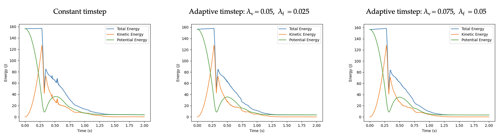

# Adaptive timestep

## Motivation

When engaging in numerical integration, the selection of the timestep relies on both the parameters of the problem and the chosen numerical scheme for discretised equations. An incorrect choice may lead to numerical instabilities, potentially resulting in a non-physical solution and program crashes. In computational fluid dynamics (CFD), a preventive measure against such issues is the use of the Courant-Friedrichs-Lewy (CFL) criterion. This criterion ensures that the numerical speed of propagation remains smaller than the one characterizing the physical problem, preventing information loss in each timestep.

One approach to maintaining numerical stability is to preset a timestep that is known _a priori_ (although not always feasible) to be sufficiently small, consistently meeting the CFL criterion and encompassing all timescales during the simulation. However, this method presents two challenges. Firstly, a timestep analysis must be conducted for each new simulated case. Secondly, there is a risk of over-resolving the temporal aspect of the problem, leading to unnecessary computations and increased CPU time for the program. To address this, many CFD codes employ an adaptive timestep procedure, dynamically adjusting the timestep during runtime based on the smallest timescales that require resolution for stability.

## Implementation
In this project, the use of adaptive timestepping is optional and determined in the `case.txt` file as a boolean variable. If it is used, a small timestep ($10^{-4}$) overwrites that specified in the `case.txt` file. The criterion used in this project is:

$$ dt = \min\left( \lambda _ \nu \frac{h}{u _ \mathrm{max}} ,  \lambda _ f \sqrt{\frac{h}{a _ \mathrm{max}}} \right)$$

where $u_\mathrm{max}$ and $a_\mathrm{max}$ are the maximum absolute velocity and absolute acceleration over all particles respectively, which are evaluated in the functions `SphSolver::updatePosition()`, `SphSolver::boundaries()` and `SphSolver::velocityIntegration`. The factors $\lambda _ \nu$ and $\lambda _ f$ are adjustable coefficients and may vary for different applications and fluids. Herein, in the default cases we make a choice of a strict criterion ($\lambda _ {\nu} = 0.05$ and $\lambda _ f = 0.025$, smallest reported values [here](http://dx.doi.org/10.2312/egsh.20151010)) to ensure that the code can operate in a variety of applications. These parameters can also be changed in the `case.txt` file. The timestep is updated at the end of every time iteration by calling the following function:

```cpp
void SphSolver::adaptiveTimestep(Fluid &data) {
  double h = data.getRadInfl();

  if (maxVelocity == 0.0 || maxAcceleration == 0.0){

    if (maxVelocity == 0.0 && maxAcceleration == 0.0){
    // Set the timestep to the default value to avoid division with zero
    dt = 1e-4;
    // Terminate the integration process because the particles will not move any further
    termination_flag = true;

    }else if (maxVelocity == 0.0){ 

      // Update the timestep based on the CFL number
      dt = coeffCfl2 * pow(h / maxAcceleration, 0.5);

    }
    else if (maxAcceleration == 0.0){ 

      // Update the timestep based on the CFL number
      dt = coeffCfl1 * h / maxVelocity;

    }
  }
  else{

    // Update the timestep based on the CFL number
    dt = std::min(coeffCfl1 * h / maxVelocity,
                  coeffCfl2 * pow(h / maxAcceleration, 0.5));
                
  }

}
```

## Efficiency and further considerations

With the default factors $\lambda _ \nu$ and $\lambda _ f$, the adaptive timestep approach required 15994 iterations to simulate a falling droplet of 800 particles and radius equal to 0.1, in opposition to the constant timestep approach which required 20000 iterations. A selection of $\lambda _ \nu = 0.075$ and $\lambda _ f = 0.05$ produced the result in only 8188 iterations.

|  | 
|:--:| 
| *Effect of adaptive timestep.* |

Regarding the constant timestep, small overshoots of the energy plots are present. These are smoothed out in the adaptive timestep cases, despite the fact that the program required a smaller amount of iterations to be executed. Regarding the adaptive timestep cases, the results are similar for both simulations which means that for this case a more relaxed than the default criterion is applicable. Although the adaptive timestep introduces an extra layer of robustness (stability of cases with high number of particles in a very tight formation is not guaranteed) and potentially increased efficiency, different fluids and cases require an adjustment of the CFL coefficients in order to exploit the advantages of the approach and, therefore, the user should be careful in their selection.
