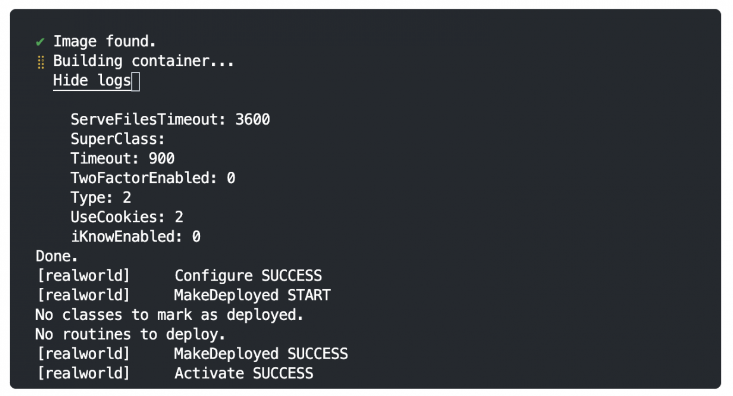

# GitHub Codespaces

GitHub Codespaces provides you with a cloud-based development environment directly within a GitHub repository. It comes pre-configured with popular tools and extensions, offering a ready-to-code set up.

There are various benefits of using GitHub (GH) codespaces, among which are consistency as it ensures that all developers work in an identical environment, preventing set up issues, and accessibility by allowing you to work from anywhere with a browser and internet connection. A potential benefit could be the scalability that it provides, as more powerful machines are available for computationally intensive SPH simulations.

In this project, it makes it easier for the user to run the SPH solver, as it is pre-configured with the necessary tools and extensions. This allows the user to focus on the development of the SPH solver and the execution of the code, without having to worry about the environment set up. You may still download the repository and run the code on your local machine, but the GH codespaces environment is a convenient alternative.

## How to Use GitHub Codespaces

1. In the [ReCoDE-SPH-solver-2D-NS GitHub repository](https://github.com/ImperialCollegeLondon/ReCoDE-SPH-solver-2D-NS), navigate to the "Code" tab
2. Locate the green "Code" button and click on it. You should see something like the following:

   

3. Click on the + sign or the green "Create codespace on main" button to create a new codespace that is based on the code of the main branch. If you would like to target a different branch, target a different region or select the type of machine to use for the new codespace, you can click on the three-dots (···) to open the options menu and select "New with options...", as shown in the following image:

   

   Then, you will be presented with the following page, allowing you to customise the codespace set up:

   

4. When you proceed with the creation of a GH codespace, you are presented with the following screen, displaying the codespace building progress:

   

5. After the Codespace has been built, you are located within a cloud-based IDE that contains the repository's code. An integrated terminal session is open by default within the codespace, allowing you to run commands in this environment. This page is a VS Code-like interface.

   

The ReCoDE-SPH-solver-2D-NS repository has been configured with a `devcontainer.json` file that defines a custom development environment with specific tools, extensions, and configurations. This is necessary to enable the user to run the commands to execute the SPH program developed in this repository. This container references a `Dockerfile`, which provides the actual instructions for the environment set up.

The `devcontainer.json` used for this repository is simple:

```
{
	"name": "sph_solver",
	"build": {
		"dockerfile": "../Dockerfile.dev"
	}
}
```

It is located within a directory named `.devcontainer`.

## Management

You can manage the available codespaces by selecting the "Manage codespaces" option from the menu in the "Code" tab of the repository:


You will be presented with a list of the currently available GH Codespaces for this repository. From here, you can perform various actions, such as renaming or stopping the codespace, changing the machine type, opening the application on a browser, and more.


