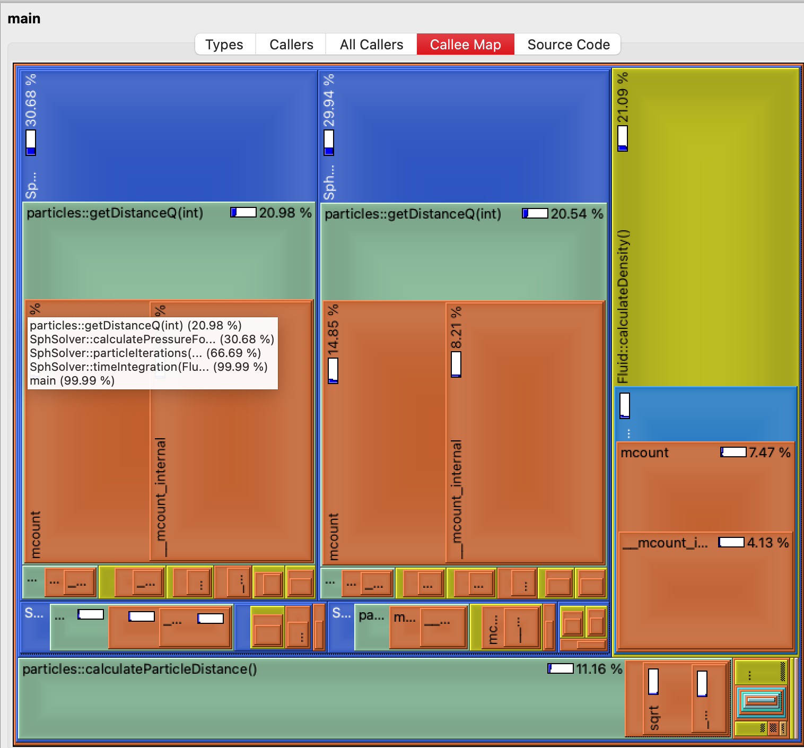
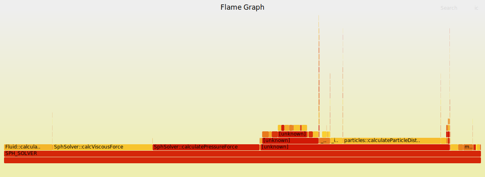
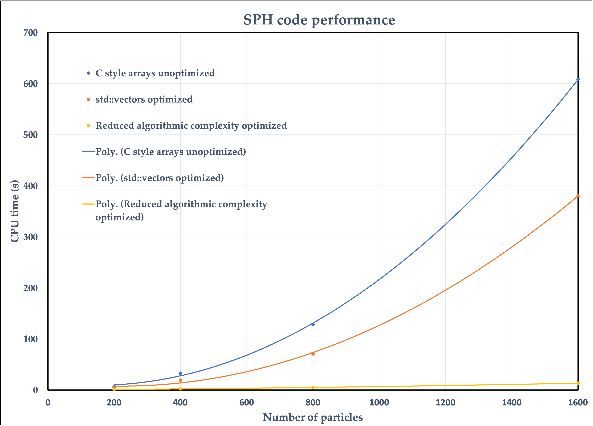
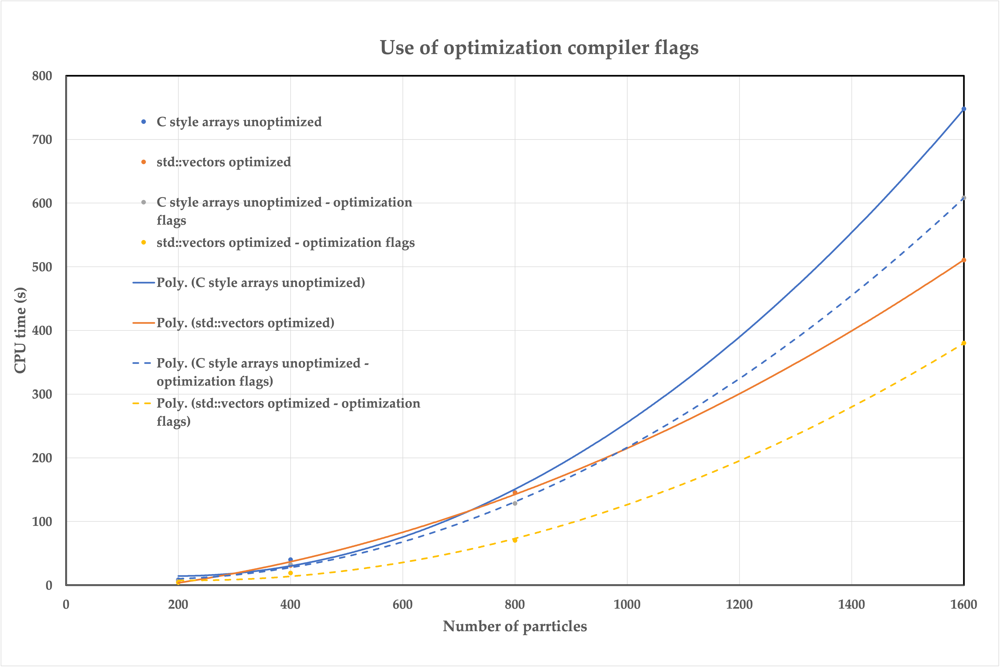
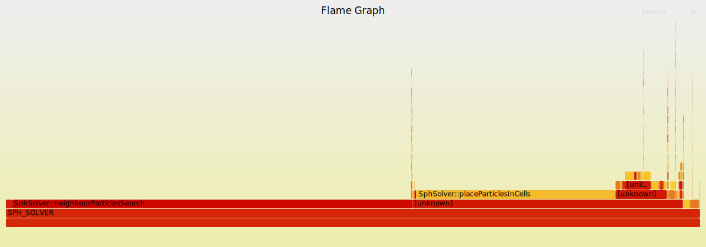

# Profiling and timing 

## Background

The profiling of this project was done in par with the refactoring. In order to make decisions regarding different algorithms and containers to be used, the developers profiled the codebase for each version separately. The profiling included tools like `valgrind`, `perf` and also the usual `time` in Linux distributions in order to get an overall execution timing of the code.

### Valgrind

Valgrind is an instrumentation framework that can be used to detect memory leaks, memory corruption, and undefined memory usage in C and C++ programs. It achieves this by running the program in a virtual environment and monitoring the memory operations. Valgrind provides several tools, including Memcheck (for memory debugging), Cachegrind (for cache profiling), and Callgrind (for call graph profiling). Callgrind is a Valgrind tool designed to profile the call structure of a program. It collects information about the functions called, the number of instructions executed in each function, and the call relationships between functions. This information can be used to identify performance bottlenecks and optimize the code.

#### Usage

1. **Installation**:

    Make sure Valgrind is installed on your system. You can typically install it using your package manager on Linux systems.
    ```bash
    sudo apt-get install valgrind   # For Debian/Ubuntu
    ```

2. **Run your program with Callgrind**:

    To profile your program with Callgrind, use the following command:
    ```bash
    valgrind --tool=callgrind <executable>
    ```

3. **Analyze the output**:

    After running the program, Valgrind will generate a **callgrind.out.\<pid>** file (where \<pid> is the process ID of your program). You can analyze this file using the `kcachegrind` tool, which provides a graphical user interface for exploring the profiling data.
    ```bash
    kcachegrind callgrind.out.<pid>
    ```

    In MacOS, the user can use `qcachegrind` to analyze the output and see which of the functions consume most of the resources. The output should be similar to the one in the picture below:

    

     ***Output of the `qcachegrind`.***

    In  the image the user can see that the functions provide a percentage of CPU usage throughout the lifetime of the execution, so any bottlenecks are easily identifiable.


### Perf

`perf` is a powerful performance analysis tool in Linux that provides a wide range of features for profiling and analyzing the performance of programs. It allows you to collect and analyze various performance-related data, such as CPU usage, memory access patterns, and more.

#### Usage

1. **Installation**:

    You can install perf on most Linux systems using your package manager.

    ```bash
    sudo apt-get install linux-tools-common   # For Debian/Ubuntu
    ```

2. **Basic Usage**:

    To collect performance data for a program, you can use the following basic command:

    ```bash
    perf record -g -p <pid>   # Record performance data for a running process
    ```
    or, for a command:
    ```bash
    perf record -g <executable>   # Record performance data for a specific command
    ```
    The `-g` option captures call-graph information, which is essential for creating flame graphs.


3. **Flamegraphs**:

    Flamegraphs are a visualization technique for profiling data that provides a detailed and intuitive representation of where time is spent in your code. They can be generated from `perf` data using tools like `FlameGraph`.

    1. **Install Flamegraph**:

        Clone the FlameGraph repository from GitHub.
        ```bash
        git clone https://github.com/brendangregg/FlameGraph.git
        ```
    
    2. **Generate Flamegraph**:

        Use the `stackcollapse-perf.pl` script to convert the `perf` data into a format suitable for flame graphs, and then use `flamegraph.pl` to generate the actual flame graph.

        ```bash
        perf script | FlameGraph/stackcollapse-perf.pl | FlameGraph/flamegraph.pl > flamegraph.svg
        ```
        This command reads the `perf script` output, collapses the stack frames, and generates a flame graph in SVG format.

    3. **View Flamegraph**:

        Open the generated SVG file (`flamegraph.svg`) in a web browser to explore the flame graph visually. The width of each box in the graph represents the proportional time spent in each function. An example is shown below (unfortunately Github doesn't allow interactive `.svg` with scripts due to exploits like XSS attacks, so the image below is not interactive):

        
         ***Flamegraph for v3.***


### Timing

In order to validate that the changes provided a significant decrease in execution time, the developers also measured the time of execution for a variety of cases. To time the execution the Linux command `time` was used. The results of `time` are usually of the given format:
```
real	0m1.806s
user	0m1.805s
sys	    0m0.000s
```

- `real`:  Refers to the actual elapsed time from the start to the finish of the command's execution. This is the "wall-clock" time, including any time spent waiting for external resources(e.g. disk I/O, network operations or waiting for other processes)
- `user`: Refers to the amount of CPU time spent executing the code within the process itself while in user mode. This means the time the CPU dedicated to running the program's instructions
- `sys`: Refers to the amount of CPU time the process spent in kernel mode. This is the time the CPU spends executing system calls on behalf of the processes, such as file operations, memory management or system services.

#### Usage

The `time` command is fairly straightforward to execute:
```bash
time <executable>
```

## SPH code results

### CPU time

#### Inter-version comparison

The performance of the code for a various number of particles can be seen in the figure bellow.

<div style="text-align: center;">
    
</div>
  
***CPU time vs number of particles for the three different versions of the code. The scatter points mark the measurements and the lines represent the fitted functions.***   

The three lines correspond to v2-v4 (see the project's repository) in increasing performance. The "C style arrays unoptimized" version displays the worst computational performance, because although it uses C style arrays which are considered to introduce a smaller overhead compared to ```std::vectors```, most of the optimizations which were described in the previous sections had not been applied yet. Therefore, it is evident that an implementation of good performance related practices can allow to overcome the computational drawbacks which may arise from creating a safer and more robust code. Regarding the final version of the code, a comparison with the previous versions reveals the change in the algorithmic complexity from $O(n^2)$ to $O(n)$. This gain in computational performance becomes extremely important as the number of particles grows and makes it possible to simulate cases with very large numbers of particles, which were not feasible before. This highlights the fact that the most important factor in the computational performance of a scientific code is the complexity of the underlying algorithm and this should be the first consideration when conceptualizing a scientific program.


#### Optimization compiler flags

In the following figure, the importance of using the proper optimization compiler flags is displayed.


<div style="text-align: center;">
    
</div>

***CPU time vs number of particles for the comparison of versions before and after the use of optimization flags. The scatter points mark the measurements and the lines represent the fitted functions.***   

Both cases display an important computational gain upon using the compiler flags with the largest number of particles shown here. However, it is interesting to notice how the "std:vectors optimized - optimization flags" version is consistently outperforming all the other cases for the full range of number of particles, while this is not the case for its counterpart where optimization flags were not used. This case performs worse for small numbers of particles, and it is only in the case of 1600 particles that it outperforms both the "C style arrays unoptimized" versions. Nevertheless, a typical SPH application is likely to incorporate very large numbers of particles and therefore the use of optimization compiler flags is recommended in any case.

### Flamegraphs

#### Results for the final version of the code

The Flamegraph of the final version of the code is displayed bellow.



***Flamegraph for the final version of the code.***

Comparing this flamegraph with the one displayed earlier we can notice the huge impact of the efficient neighbour searching on the computational behaviour of the code. In the earlier versions, most of the CPU time was mainly spent on the calculation of the viscous and pressure forces, and the inter-particle distance calculations. On the contrary, in the final version of the code, most of the CPU time is spent on the neighbour searching algorithm whose complexity is smaller than the earlier inter-particle distance calculation procedure (!). Therefore, not only the introduction of this feature decreased the time which was devoted for the neighbour searching, but also it helped to eliminate the computational burden that was imposed by the calculation of the pressure and viscous forces. 

#### Interpreting the flamegraphs

Flamegraphs are a great tool for assisting the design process of optimization strategies. In this case, we can conclude that probably spending more time in optimizing the force calculation functions would be pointless, and our attention should focus mostly on the neighbour searching procedure. While on the contrary, if we were to use the older versions of the code, our decision would be different.

One typical strategy for reducing the computational cost of scientific codes, is to parallelize them by using domain decomposition. However, by advising the latter flamegraph we may conclude that fully parallelizing the code may be too elaborate and probably not useful. One good starting point could be to just parallelize the interfacing of the particles and the neighbour searching function, as these are mainly the code's bottlenecks.