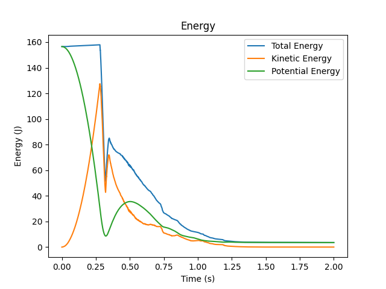
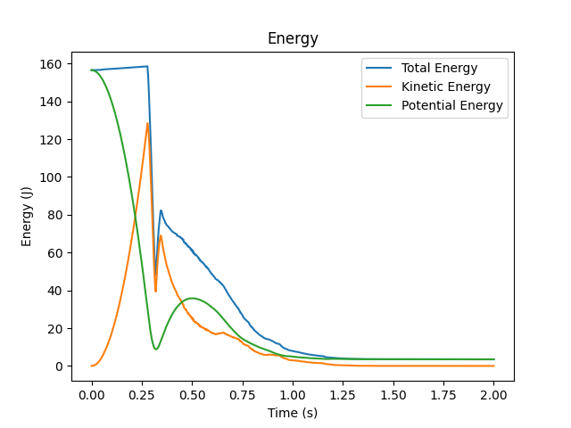

# Adaptive timestep

## Motivation
When performing numerical integration, the choice of timestep depends on the problem's parameters and the numerical scheme which was chosen to discretize the equations. A wrong choice can result to numerical instabilities and ultimately to a non-physical solution which could possibly cause our program to crash. In CFD to avoid such incidences we make use of the so called CFL criterion which ensures that the numerical speed of propagation is smaller than the one which characterizes the physical problem, and no information is lost during any timestep. A way of ensuring stability of numerical computations is to predefine a timestep which is known a priori (not always the case) to be small enough and always satisfy the CFL criterion and capture all ranges of timescales that may appear during the simulation. However, there are two problems associated with this approach. The first is that a timestep analysis should be performed every time a new case is simulated, and the second is that we may over-resolve our problem in time and perform unnecessary computations which will eventually increase the CPU time of our program. To deal with this problem, most CFD codes make use of an adaptive timestep procedure which adjusts the timestep at runtime based on the smallest timescales which need to be resolved in order to ensure stability. 

## Implementation
In this project, the use of adaptive timestep is optional and determined in the ```case.txt``` file as a boolean variable. If it is used, a small timestep ($10^{-4}$) overwrites the specified by the ```case.txt``` value. The criterion used in this project is:

$$ dt = \min( \lambda _ \nu \frac{h}{u _ {max}} ,  \lambda _ f \sqrt{\frac{h}{a _ {max}}} )$$

Where $u_{max}$ and $a_{max}$ are the maximum absolute velocity and absolute acceleration over all particles respectively, and are being evaluated in the functions ```SphSolver::updatePosition()```, ```SphSolver::boundaries()``` and ```SphSolver::velocityIntegration```. The factors $\lambda _ \nu$ and $\lambda _ f$ are adjustable coefficients and may vary for different applications and fluids. Herein, in the default cases we make a choice of a strict criterion ($\lambda _ {\nu} = 0.05$ and $\lambda _ f = 0.025$, smallest reported values in DOI: 10.2312/egsh.20151010) to ensure that the code can operate in a variety of applications. These parameters can also be changed in the ```case.txt``` file. The timestep is being updated at the end of every time iteration by calling the following function:

```cpp
void SphSolver::adaptiveTimestep(Fluid &data) {
  double h = data.getRadInfl();

  // Update the timestep based on the CFL number
  dt = std::min(coeffCfl1 * h / maxVelocity, coeffCfl2 * pow(h / maxAcceleration, 0.5));

}
```

## Efficiency and further considerations

With the default  factors $\lambda _\nu $ and $\lambda _f$, the adaptive timestep approach required 15994 iterations to simulate a falling droplet of 800 particles in opposition to the constant timestep approach which would require 20000 iterations. A selection of $\lambda _\nu = 0.075 $ and $\lambda _f = 0.05$ resulted to only 8188 iterations with the following results.

<div style="text-align: center;">
    
    
    
</div>

 ***Energy plots with the default CFL coefficients (left) and with $\lambda _ \nu = 0.075$ , $\lambda _ f = 0.05$ (right).***

Although the adaptive timestep introduces an extra layer of robustness and potentially increased efficiency, different fluids and cases require an adjustment of the CFL coefficients in order to exploit the advantages of the approach and therefore, the user should be careful in their selection.
