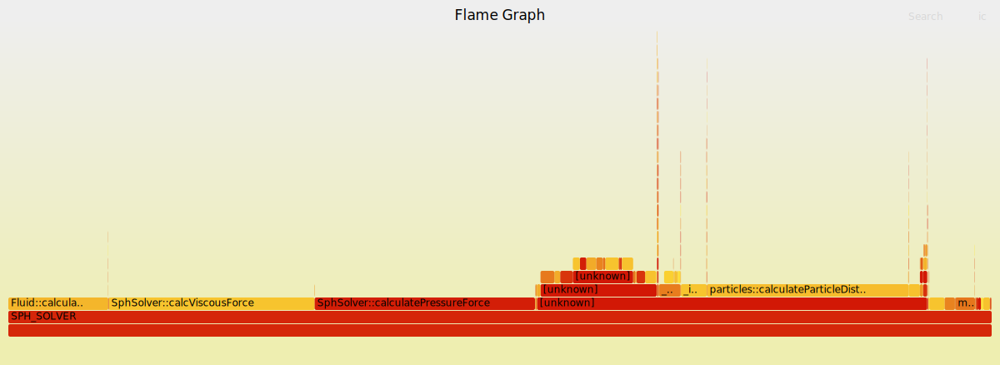

# Profiling

The profiling of this project was done in par with the refactoring. In order to make decisions regarding different algorithms and containers to be used, the developers profiled the codebase for each version separately. The profiling included tools like `valgrind`, `perf` and also the usual `time` in Linux distros in order to get an overall execution timing of the code.

## Valgrind

Valgrind is an instrumentation framework that can be used to detect memory leaks, memory corruption, and undefined memory usage in C and C++ programs. It achieves this by running the program in a virtual environment and monitoring the memory operations. Valgrind provides several tools, including Memcheck (for memory debugging), Cachegrind (for cache profiling), and Callgrind (for call graph profiling). Callgrind is a Valgrind tool designed to profile the call structure of a program. It collects information about the functions called, the number of instructions executed in each function, and the call relationships between functions. This information can be used to identify performance bottlenecks and optimize the code.

### Usage

1. **Installation**:

    Make sure Valgrind is installed on your system. You can typically install it using your package manager on Linux systems.
    ```bash
    sudo apt-get install valgrind   # For Debian/Ubuntu
    ```

2. **Run your program with Callgrind**:

    To profile your program with Callgrind, use the following command:
    ```bash
    valgrind --tool=callgrind <executable>
    ```

3. **Analyze the output**:

    After running the program, Valgrind will generate a **callgrind.out.\<pid>** file (where \<pid> is the process ID of your program). You can analyze this file using the `kcachegrind` tool, which provides a graphical user interface for exploring the profiling data.
    ```bash
    kcachegrind callgrind.out.<pid>
    ```

    In MacOS, the user can use `qcachegrind` to analyze the output and see which of the functions consume most of the resources. The output should be similar to the one in the picture below:

    

    In  the image the user can see that the functions provide a percentage of CPU usage throughout the lifetime of the execution, so any bottlenecks are easily identifiable.


## Perf

`perf` is a powerful performance analysis tool in Linux that provides a wide range of features for profiling and analyzing the performance of programs. It allows you to collect and analyze various performance-related data, such as CPU usage, memory access patterns, and more.

### Usage

1. **Installation**:

    You can install perf on most Linux systems using your package manager.

    ```bash
    sudo apt-get install linux-tools-common   # For Debian/Ubuntu
    ```

2. **Basic Usage**:

    To collect performance data for a program, you can use the following basic command:

    ```bash
    perf record -g -p <pid>   # Record performance data for a running process
    ```
    or, for a command:
    ```bash
    perf record -g <executable>   # Record performance data for a specific command
    ```
    The `-g` option captures call-graph information, which is essential for creating flame graphs.


3. **Flamegraphs**:

    Flamegraphs are a visualization technique for profiling data that provides a detailed and intuitive representation of where time is spent in your code. They can be generated from `perf` data using tools like `FlameGraph`.

    1. **Install Flamegraph**:

        Clone the FlameGraph repository from GitHub.
        ```bash
        git clone https://github.com/brendangregg/FlameGraph.git
        ```
    
    2. **Generate Flamegraph**:

        Use the `stackcollapse-perf.pl` script to convert the `perf` data into a format suitable for flame graphs, and then use `flamegraph.pl` to generate the actual flame graph.

        ```bash
        perf script | FlameGraph/stackcollapse-perf.pl | FlameGraph/flamegraph.pl > flamegraph.svg
        ```
        This command reads the `perf script` output, collapses the stack frames, and generates a flame graph in SVG format.

    3. **View Flamegraph**:

        Open the generated SVG file (`flamegraph.svg`) in a web browser to explore the flame graph visually. The width of each box in the graph represents the proportional time spent in each function. An example is shown below (unfortunately Github doesn't allow interactive `.svg` with scripts due to exploits like XSS attacks, so the image below is not interactive):

        


